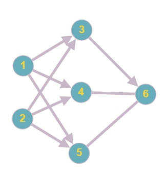

# Entrainement_ReseauNeuronaux
## Description 

Ce projet est une initiation au Système de réseau neuronaux. Il est codé en <b>Python</b>
Pour changer le nombre d'entrainement, il faut changer la variable <i>nb_iteration</i>
## Contexte

Nous prenons comme contexte une étude botanique. En étudiant la taille et la couleur de certaine feuille, on veut en déduire leur couleur.

Nous avons observé 8 feuilles dont on a recencé les tailles [longueur,largeur]  :  [3,1.5], [2,1], [4,1.5], [3,1], [3.5,0.5], [2,0.5], [5.5,1], [1,1]
Nous avons également noté leur couleur ( 0 pour du bleu/ 1 pour du rouge ) : [1], [0], [1], [0], [1], [0], [1], [0]

Nous recherchons à l'aide d'un système de réseau neuronaux la couleur d'une feuille de taille : [4,1.5]

## Illustration

les sommets 1 et 2 représente les inputs, les sommets 3,4 et 5 représente les neuronnes cachés tandis que les sommets 6 et 7 sont les outputs.
Le poids des arêtes entre les sommets est modifié par le programme afin de trouver les outputs à partie d'inputs.

## Fonctionnement

Le réseau neuronal possède deux fonctions majeurs. La première appelé "forward" utilise la fonction sigmoid et permet de transformer les inputs en output. La deuxième appelé "backward" permet de calculer l'erreur qu'il y a entre les output sortie par le programme et les vrais output. Elle permet aussi de modifier les valeurs des arêtes. Ensuite, il faut faire tourner plusieurs fois ces deux fonctions (ici avec la fonction "train()" ). 

Nous avons fait tourner ici la fonction <i>train()</i> 300 000 fois.
